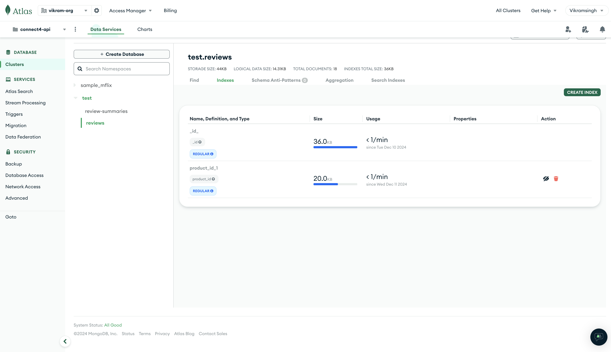
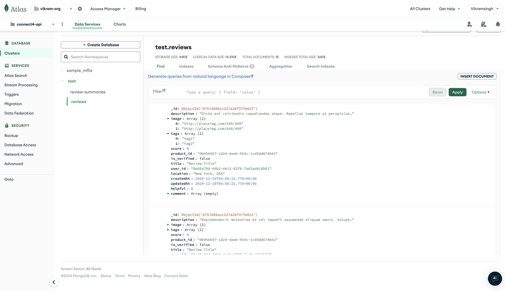
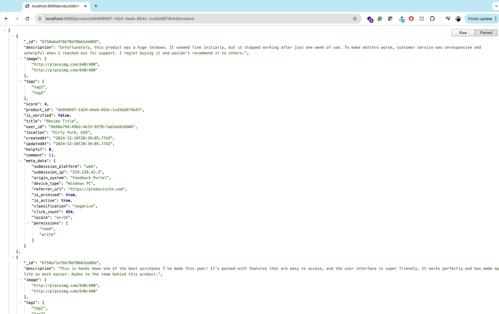
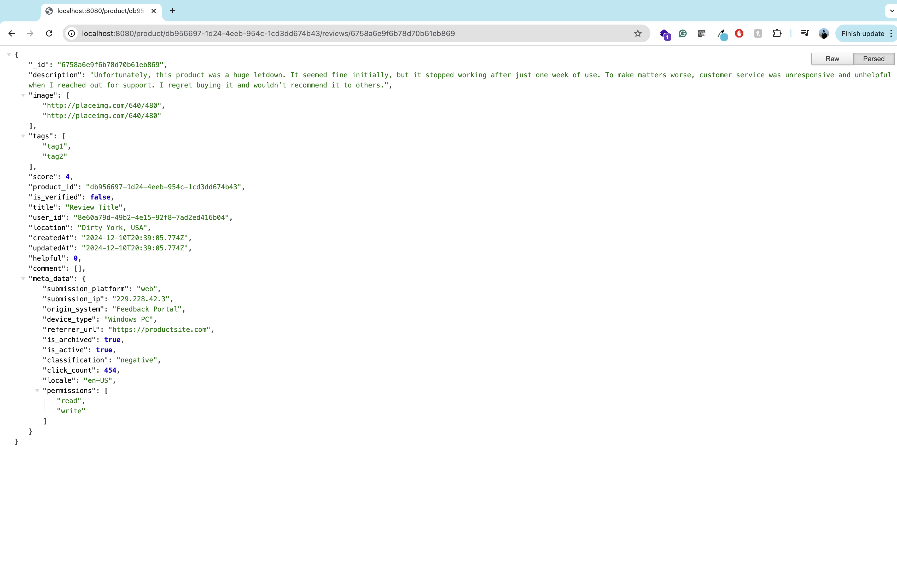
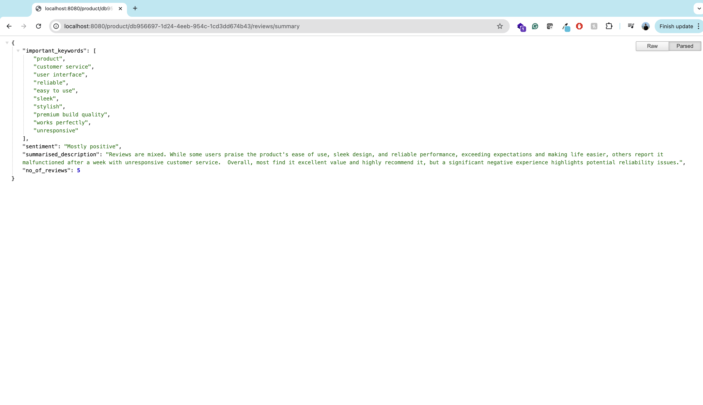
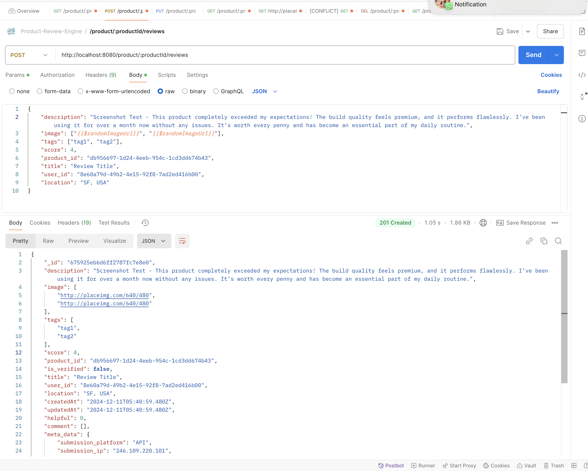

# Project Type: Implementation

# Installation and Setup Guide

This guide provides detailed instructions for setting up and running the   project with TypeScript. The application is not hosted online due to the lack of free-tier hosting services that support Node.js without additional costs, as Heroku and similar platforms no longer provide free tiers.

## Prerequisites

Before proceeding, ensure the following software is installed and properly configured on your system:

1. **Node Version Manager (nvm):** Used to manage Node.js versions.
2. **Node.js (v20):** Required for running the application. Install exactly version 20 to match the environment specified in the `package.json` file.
3. **npm (Node Package Manager):** Comes bundled with Node.js.
4. **Git:** For cloning the repository.

---

## Step-by-Step Setup

### 1. Clone the Repository

Begin by cloning the repository to your local machine:

```bash
git clone https://github.com/vik98/reviews-summariser-206.git
cd reviews-summariser-206
```

---

### 2. Install Node.js Version 20 Using nvm

Use `nvm` to install and use Node.js version 20. If you do not have `nvm` installed, follow the instructions [https://docs.npmjs.com/downloading-and-installing-node-js-and-npm](https://docs.npmjs.com/downloading-and-installing-node-js-and-npm).

#### Install Node.js version 20:

```bash
nvm install 20.17.9
nvm use 20.17.9
```

#### Verify Node.js and npm versions:

```bash
node -v
# Output should be: v20.x.x

npm -v
# Ensure npm is installed correctly
```

---

### 3. Install Dependencies

Install the required dependencies using npm. This includes both `dependencies` and `devDependencies` as specified in `package.json`. This has to be run inside the project directory.

```bash
npm install
```

---

### 4. Environment Configuration

This project uses the `dotenv` library to manage environment variables. Create a `.env` file in the project root directory to define any environment-specific variables. For example:

```env
API_KEY=
```

Ensure you replace the placeholder value with the actual API key mentioned in the submission's comment section. The mongo URI is already present in the code with all level access to the user `review-admin`. You only need to add the API_KEY and PORT if you'd like to or if its occupied.

---

### 5. Running the Application

The `package.json` file provides multiple scripts for different purposes:

#### Build the Application:

Compile the TypeScript code into JavaScript using the TypeScript Compiler (`tsc`).

```bash
npm run build
```

#### Run in Development Mode:

This script uses `nodemon` for automatic restarts on file changes.

```bash
npm run dev
```

#### Start the Application:

This script uses `ts-node` to directly run the TypeScript file.

```bash
npm run start
```

---

### 6. Project Structure

Understanding the file structure will help in navigating and modifying the project:

- **`src/`**: Contains the source code.
  - **`index.ts`**: The main entry point of the application.
- **`test/`**: Contains test files.
- **`package.json`**: Lists project metadata, scripts, and dependencies.
- **`tsconfig.json`**: Configuration file for TypeScript.
- **`.env`**: Environment variables (user-created).

---

### Notes on Hosting

- This project is not hosted online because most free-tier hosting services, including Heroku, no longer support Node.js without additional tier pricing.

---

## Troubleshooting

1. **Node Version Issues:**

   - If the application fails to start, ensure you are using Node.js version 20 by running:
     ```bash
     nvm use 20.17.9
     ```

2. **Dependency Errors:**

   - Delete `node_modules` and `package-lock.json`, then reinstall dependencies:
     ```bash
     rm -rf node_modules package-lock.json
     npm install
     ```

3. **Environment Variable Errors:** Ensure the `.env` file is correctly configured and matches the expected variables in the code. If the port is occupied change the port to some other port or kill the process using the current port.

# Incorporating Class Concepts

## Meta Data

In this project, the `meta_data` field within the `Review` object serves as a key-value pair container for additional contextual information about a review. We use `Record<string, string | number | boolean>` to enforce type safety while allowing flexibility for various metadata fields. Another reason the metadata field is not enforced an type so we can ensure flexibility and add more fields in the future per requirements. The schema for this is created using **MongooseJS**, a powerful ODM (Object Data Modeling) library for MongoDB. Below is the detailed schema for the `Review` object:

### Mongoose Schema for Review

```typescript

interface IReview {
    description: string;
    image: string[];
    comment: IComment[];
    tags: string[];
    score: number;
    helpful: number;
    product_id: string;
    is_verified: boolean;
    createdAt: Date;
    updatedAt: Date;
    title: string;
    user_id: string;
    location: string;
    meta_data: Record<string, string | number | boolean | string[]>;
}

interface IComment {
    description: string;
    createdAt: Date;
    updatedAt: Date;
    title: string;
    user_id: string;
}

interface IReviewAISummary {
    no_of_reviews: number;
    summarised_description: string;
    important_keywords: string[];
    sentiment: string;
}
```

The above schema ensures a consistent structure for reviews, while the `meta_data` field allows for extensible and dynamic data. 

---

## Data Modeling and JSON

To organize and store data efficiently, the review data follows a JSON structure, ensuring a clear representation for each review. Below is an example JSON for a review:

### Example JSON for Review

```json
{
        "_id": "6758a6e9f6b78d70b61eb869",
        "description": "Unfortunately, this product was a huge letdown. It seemed fine initially, but it stopped working after just one week of use. To make matters worse, customer service was unresponsive and unhelpful when I reached out for support. I regret buying it and wouldn’t recommend it to others.",
        "image": [
            "http://placeimg.com/640/480",
            "http://placeimg.com/640/480"
        ],
        "tags": [
            "tag1",
            "tag2"
        ],
        "score": 4,
        "product_id": "db956697-1d24-4eeb-954c-1cd3dd674b43",
        "is_verified": false,
        "title": "Review Title",
        "user_id": "8e60a79d-49b2-4e15-92f8-7ad2ed416b04",
        "location": "Dirty York, USA",
        "createdAt": "2024-12-10T20:39:05.774Z",
        "updatedAt": "2024-12-10T20:39:05.774Z",
        "helpful": 0,
        "comment": [],
        "meta_data": {
            "submission_platform": "web",
            "submission_ip": "229.228.42.3",
            "origin_system": "Feedback Portal",
            "device_type": "Windows PC",
            "referrer_url": "https://productsite.com",
            "is_archived": true,
            "is_active": true,
            "classification": "negative",
            "click_count": 454,
            "locale": "en-US",
            "permissions": [
                "read",
                "write"
            ]
        }
    }
```

### **Metadata Fields and Descriptions**

1. **`submission_platform`**  
   - **Description**: Indicates the platform from which the review was submitted, such as `web`, `mobile`, or `API`.  
   - **Example**: `web` means the review was submitted through the website interface.

2. **`submission_ip`**  
   - **Description**: Captures the IP address of the user who submitted the review. This can be useful for tracking and analytics or detecting suspicious activity.  
   - **Example**: `229.228.42.3`.

3. **`origin_system`**  
   - **Description**: Refers to the system or application where the review originated. This is useful for identifying the source of feedback when multiple systems are in place.  
   - **Example**: `Feedback Portal` means the review was submitted through a designated feedback system.

4. **`device_type`**  
   - **Description**: Specifies the type of device used to submit the review. Helps in understanding device-specific user behavior or troubleshooting issues.  
   - **Example**: `Windows PC`.

5. **`referrer_url`**  
   - **Description**: The URL of the page that referred the user to the review submission form. It helps in tracking user navigation and source pages.  
   - **Example**: `https://productsite.com`.

6. **`is_archived`**  
   - **Description**: A boolean flag indicating whether the review has been archived. Archived reviews are typically stored but not displayed to users.  
   - **Example**: `true`.

7. **`is_active`**  
   - **Description**: A boolean flag that shows if the review is currently active and visible in the system. Inactive reviews may be temporarily hidden or disabled.  
   - **Example**: `true`.

8. **`classification`**  
   - **Description**: Categorizes the sentiment or type of the review, such as `positive`, `negative`, or `neutral`. Useful for sentiment analysis and filtering.  
   - **Example**: `negative`.

9. **`click_count`**  
   - **Description**: Tracks how many times the review has been clicked or interacted with by other users. This provides insights into engagement levels.  
   - **Example**: `454`.

10. **`locale`**  
    - **Description**: Specifies the locale or language settings of the user submitting the review. This can help in tailoring content to the user's language preferences.  
    - **Example**: `en-US`.

11. **`permissions`**  
    - **Description**: Lists the permissions or actions allowed for the review, such as `read` or `write`. This is useful for access control and moderation.  
    - **Example**: `["read", "write"]`.


This JSON structure ensures that the data remains highly organized and can be easily parsed and manipulated.

---

## Data Storage Using NoSQL Database

The reviews are stored in a NoSQL database using **MongoDB**, hosted on **MongoDB Atlas** for scalability and reliability. MongoDB’s document-based model aligns perfectly with the JSON structure of the review data.

### Key Features:

1. **Flexibility**: MongoDB allows for dynamic schemas, which is ideal for storing the `meta_data` field with varied keys and values.
2. **Scalability**: Hosted on MongoDB Atlas, the database benefits from distributed clusters and it ensures high availability and performance.
3. **Indexing**: We have indexed the `product_id` field to enable fast lookups and efficient retrieval of reviews.

---

## Summarized Review JSON

To optimize data retrieval for analytical purposes, we provide a summarized JSON format for reviews:

### Example Summarized Review JSON

```json
{
  "important_keywords": [
    "product",
    "customer service",
    "user interface",
    "reliable",
    "easy to use",
    "sleek",
    "stylish",
    "premium build quality",
    "works perfectly",
    "unresponsive"
  ],
  "sentiment": "Mostly positive",
  "summarised_description": "Reviews are mixed. While some users praise the product's ease of use, sleek design, and reliable performance, exceeding expectations and making life easier, others report it malfunctioned after a week with unresponsive customer service.  Overall, most find it excellent value and highly recommend it, but a significant negative experience highlights potential reliability issues.",
  "no_of_reviews": 5
}
```

This summarized format allows quick insights into product performance which is reducing the need for heavy data processing.

---

## Indexing and Searching Concept

### Use of Indexing

We have indexed the `product_id` field in the `Review` schema. Indexing ensures that queries filtered by `product_id` (e.g., retrieving all reviews for a specific product) are processed efficiently.

### Benefits of Indexing

1. **Improved Search Speed**: Indexing reduces the time complexity of search operations from O(n) to O(log n) in most cases.
2. **Efficient Retrieval**: When retrieving reviews for a specific product, the database uses the index to quickly locate the relevant documents.

Note - In my case I created the index manually in the Atlas console. Refer screenshots. Below is the way it can be achieved using mongoose

### Mongoose Implementation

```typescript
const ReviewSchema = new Schema({
    // Other fields...
    product_id: { type: String, required: true, index: true },
    // Other fields...
});
```

This ensures that any query using `product_id` as a filter leverages the index which makes it significantly faster. 

Indexing Screenshot  - 



Sample Data from Database - 



---

All in all we have incorporated class concepts such as metadata management, JSON structuring, NoSQL storage, and indexing, data storage, data organisation using modeling, data retrieval using APIs in this project.

# Working Screenshots

Get all Reviews for a productId - 



Get Review by ReviewID and productId - 



Get Summary of all the Reviews per productId - 



Post a review for a productId - 



Postman collection JSON (in the parent directory) - 
Reviews-Summariser-206.postman_collection.json
